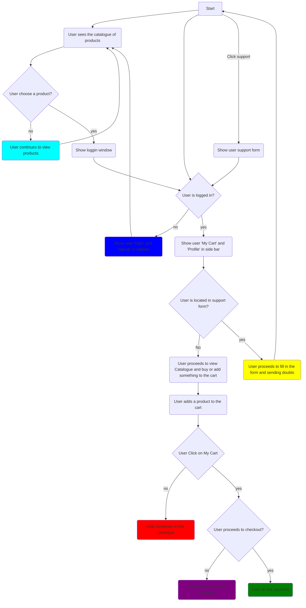

# SmartNet
SmartNet Shop
Smartnet is a store that addresses the sale of equipment for Networking, which includes product purchase, shopping cart and online support.


# Data Flow Diagram
Data inside SmartNet follow the next diagram


<style>
    .mermaid svg { height: auto; }
</style>



# Requirements
- [Python](https://www.python.org/ "Python latest version")

# Installation
1. After installing python, download the current version of this repository, you can do it with the following command or download the zip archive and extract it:
``` bash
git clone https://github.com/1930346/SmartNet.git
```
2. Open a terminal and navigate to the SmartNet folder:
``` bash
cd SmartNet
```
3. Create a virtual environment and activate it:
```bash
mkdir venv
python3 -m venv venv/fastapi-mysql
```
If you are using Windows, you can use the following commands:
```pwsh
python -m venv fastapi-mysql

fastapi-mysql\Scripts\activate

```
If you are using a POSIX system (Linux, MACOS), you can use the following command:
```bash
source venv/fastapi-mysql/bin/activate
```
4. Run the following commands to install FastAPI as a package and install all the dependencies and update pip:
``` bash
pip install --upgrade pip
```
If you are using windows:
``` bash
python -m pip install --upgrade pip

```
   
5. Run the following command to run the SmartNet API:
``` bash
uvicorn app:app --reload
```